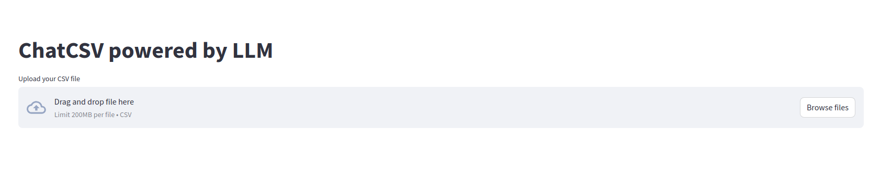
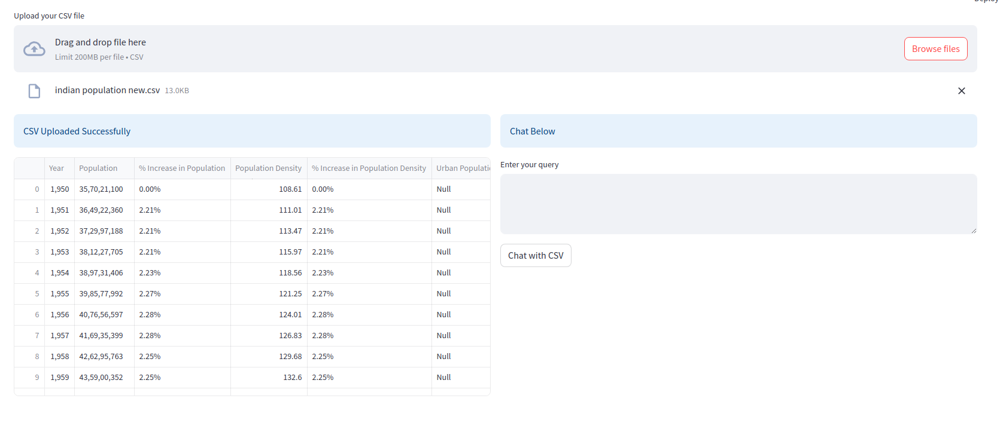
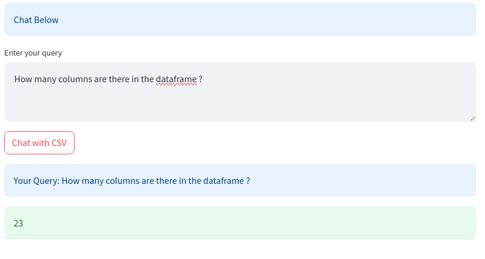

# ChatCSV-Streamlit-App
An LLM powered ChatCSV Streamlit app so you can chat with your CSV files.

# How it works ?

The application reads the CSV file and processes the data. It utilizes ollama LLMs alongside with Langchain Agents in order to answer your questions. The CSV agent then uses tools to find solutions to your questions and generates an appropriate response with the help of a LLM.

The application employs Streamlit to create the graphical user interface (GUI) and utilizes Langchain to interact with the LLM.

## Installation

To install the repository, follow these steps:

1. Clone this repository to your local machine.
2. Install the necessary dependencies by running the following command:

   ```
   pip install -r requirements.txt
   ```

  ### Installing ollama

  1. Click on link https://ollama.com/download/linux to navigate to ollama official website.
  2. Choose your OS and download ollama. For example, I am using Linux, so I will be firing command

  ```
  curl -fsSL https://ollama.com/install.sh | sh
  ```

  3. Now, open terminal in linux and fire below command to pull llama3 model, so that we can run the model localy.

  ```
  ollama pull llama3
  ```

## Usage

To use the application, execute the `app.py` file using the Streamlit CLI. Make sure you have Streamlit installed before running the application. Run the following command in your terminal:

```
streamlit run main.py
```

1. After running above command, the terminal must have a localhost url that redirects to home page of app that looks like this,



2. Click on "Browse files" and select the csv file to upload the csv file. After uploading, we must see the data as shown in pic below:



3. Now enter your query to ask questions about csv and the llm must return the correct output.
Example:



## Observation

Using ollama llama3, I am able to answer basic questions about csv. But, when it comes to more complex questions, the agent took some time and the results are not consistent. Sometimes, the agent will return correct output, sometimes not.

# NOTE

I have added a folder named "Tried_other_ways". In that folder, I have uploaded all the scripts that I tried before making the final python script.
